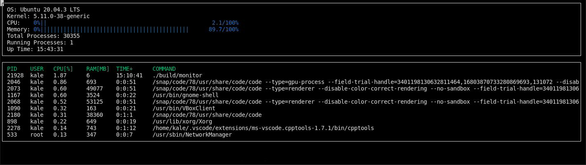

# CppND-System-Monitor

## Description
This is a C++ program designed to provide system statistics for a linux machine to the terminal, completed with starter code from Udacity's C++ course.
If you are a Windows user and wish to recreate this project, I would suggest using a Linux Virtual Machine. The Machine I used was the Oracle VM VirtualBox with ubuntu,  
which can be downloaded [here](https://www.oracle.com/virtualization/solutions/try-oracle-vm-virtualbox/?source=:ad:pas:go:dg:a_nas:71700000079711823-58700006707759345-p60691657643:RC_WWMK200609P00103C0001:&SC=:ad:pas:go:dg:a_nas::RC_WWMK200609P00103C0001:&gclid=CjwKCAjwn8SLBhAyEiwAHNTJbWLRRYow8w1X-eVC9k7tkcn_YDTtQt9UhaIET7fYU4niVVu_hl1ukRoCKAEQAvD_BwE&gclsrc=aw.ds)

## ncurses
[ncurses](https://www.gnu.org/software/ncurses/) is a library that facilitates text-based graphical output in the terminal. This project relies on ncurses for display output.

To install ncurses within your own Linux environment: `sudo apt install libncurses5-dev libncursesw5-dev`

## Make
This project uses [Make](https://www.gnu.org/software/make/). The Makefile has four targets:
* `build` compiles the source code and generates an executable
* `format` applies [ClangFormat](https://clang.llvm.org/docs/ClangFormat.html) to style the source code
* `debug` compiles the source code and generates an executable, including debugging symbols
* `clean` deletes the `build/` directory, including all of the build artifacts

## Instructions

1. Clone the repository: `git clone https://github.com/KaleTEvans/Linux-System-Monitor.git`

2. Build the project: `make build`

3. Run the resulting executable: `./build/monitor`

4. Follow along with the lesson.

5. Implement the `System`, `Process`, and `Processor` classes, as well as functions within the `LinuxParser` namespace.

6. Submit!